# JourneyMate🚗📱

**Android Cab-Sharing Application**

JourneyMate is an Android application developed to provide a secure, structured and cost‑effective cab‑sharing solution for students of Banasthali Vidyapith. The application replaces unorganized WhatsApp-based coordination with a dedicated, role‑based mobile platform built using modern Android development practices.

---

## 🔍 Problem Overview

Banasthali Vidyapith is located approximately 60 km from Jaipur, making frequent travel costly and inconvenient for students. Existing solutions rely on informal messaging groups, which suffer from poor visibility, lack of trust and inefficient coordination.

JourneyMate addresses these challenges by enabling students and verified drivers to create, discover and manage shared cab trips in a structured and reliable manner.

---

## 🎯 Project Objectives

* Design a centralized cab‑sharing system for students
* Reduce travel costs through ride pooling
* Improve safety and trust using verified captains (drivers)
* Provide a scalable Android solution using clean architecture

---

## 🛠️ Tech Stack & Tools

* **Language:** Kotlin
* **Platform:** Android
* **Architecture:** MVVM (Model‑View‑ViewModel)
* **Backend & Auth:** Firebase Authentication, Firebase Realtime Database
* **Local Storage:** SQLite
* **IDE:** Android Studio
* **Build System:** Gradle

---

## 👥 User Roles

### 👩‍🎓 Student (Trip Mate / Trip Chief)

* Secure sign‑up & login
* Create trips (Trip Chief)
* Search and join existing trips
* In‑app chat with trip members
* View trip history & manage profile

### 🚖 Captain (Verified Driver)

* Registration with ID verification
* Create and manage trips
* Accept or reject ride requests
* Communicate with passengers

---

## ✨ Key Features

* 🔐 Secure authentication & authorization
* 🗺️ Route‑based trip discovery
* 🚕 Real‑time seat availability tracking
* 💬 In‑app messaging system
* 👩 Women‑only ride preference for safety
* 🚫 User reporting & blocking mechanism

---

## 🧩 Core Modules

* User Authentication & Profile Management
* Trip Creation & Ride Matching
* Request Handling & Seat Allocation
* Messaging & Notifications
* Local & Cloud Data Synchronization

---

## 🧪 Testing & Validation

The application was tested across multiple scenarios including:

* Student & captain workflows
* Authentication flows
* Trip creation, joining, and updates
* Messaging reliability

All major functional test cases passed successfully.

---

## 📐 Architecture & Design

* Follows MVVM architecture for separation of concerns
* Modular and maintainable codebase
* Uses Firebase + SQLite for efficient data handling
* Designed for future scalability and feature expansion

---

## 🚀 How to Run the Project

1. Clone the repository:

   ```bash
   git clone https://github.com/khushisingh39/JourneyMate.git
   ```
2. Open the project in **Android Studio**
3. Sync Gradle dependencies
4. Add your Firebase configuration file (`google-services.json`)
5. Run on an emulator or physical device (Android 8.0+)

> Note: Firebase configuration files are excluded for security reasons.

---

## 📱 Screenshots

### Onboarding & Authentication

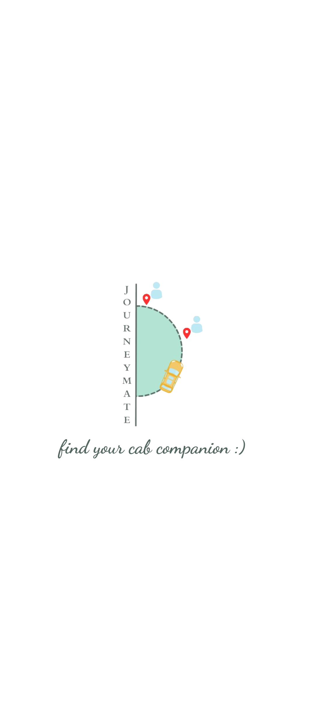
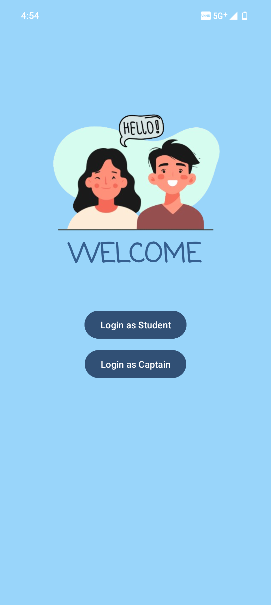
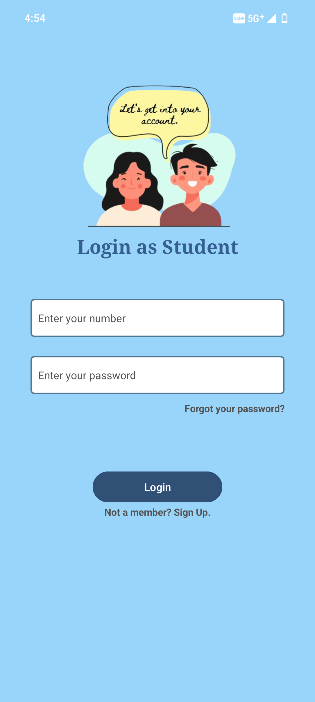
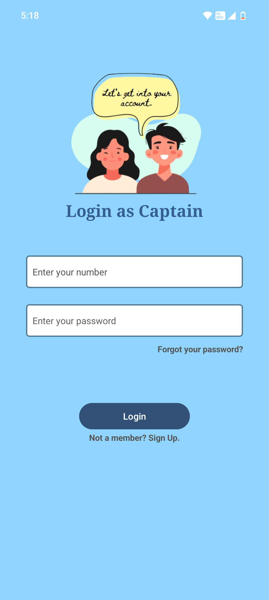

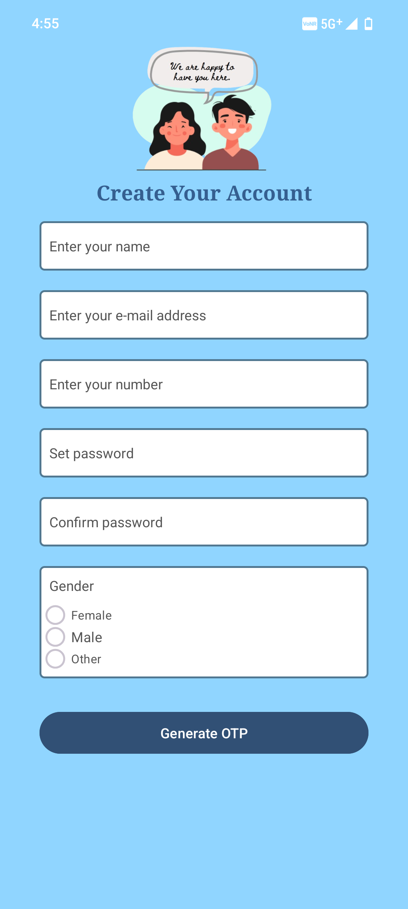
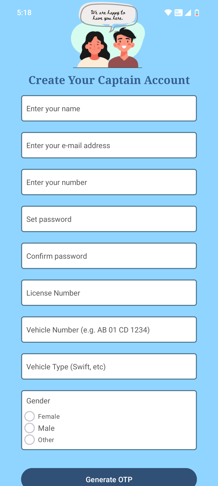


---

### Trip Management

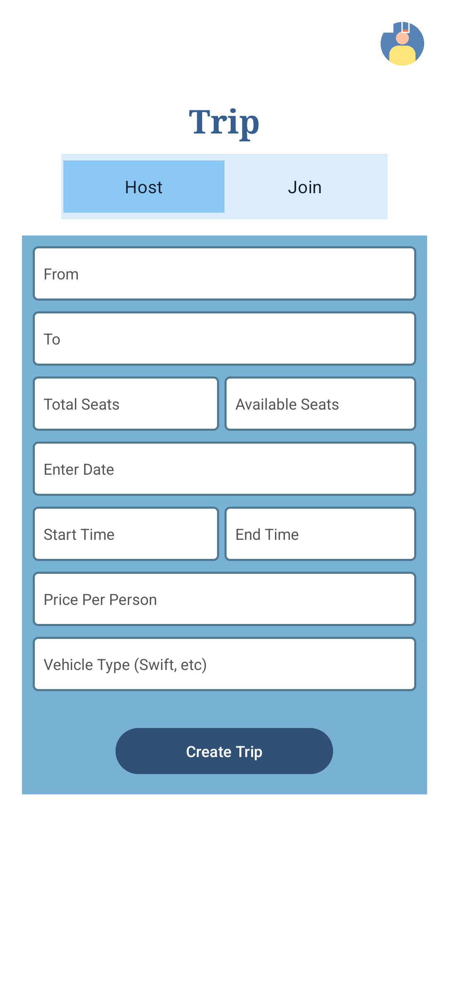
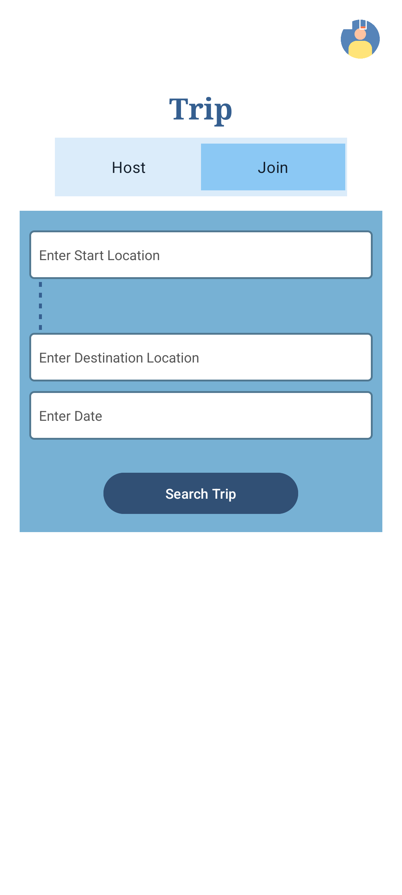

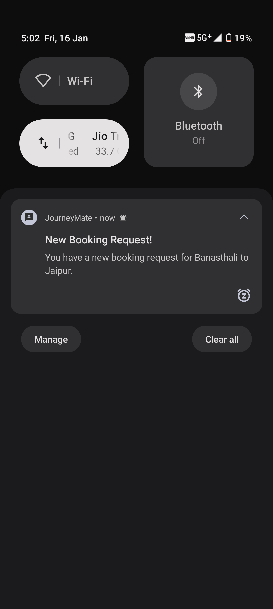
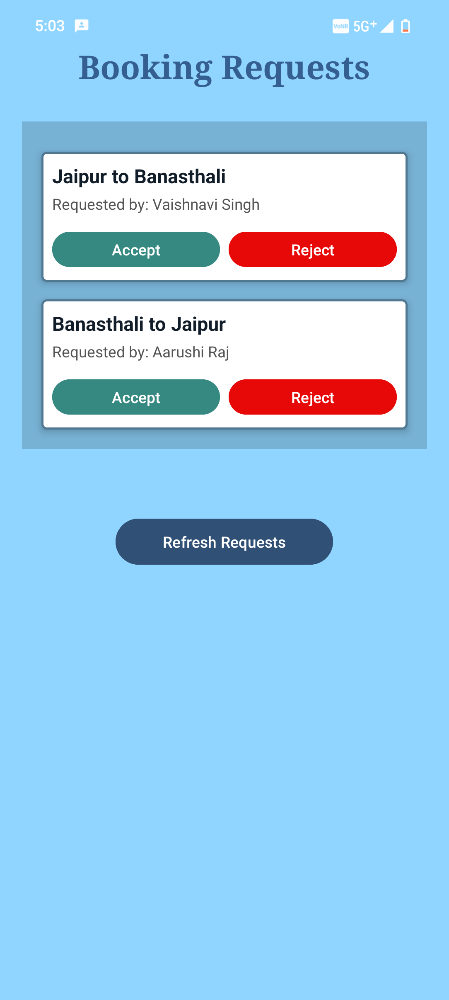
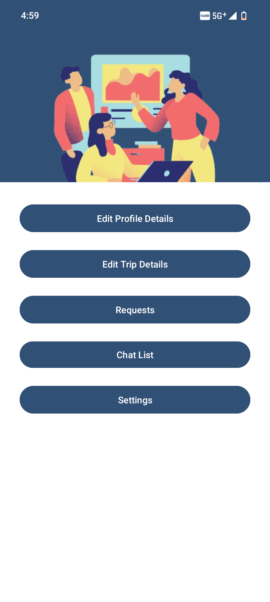
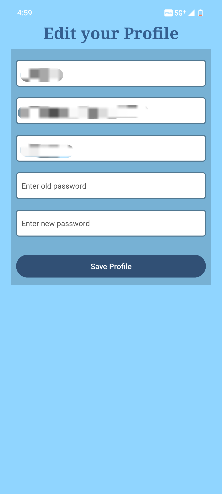
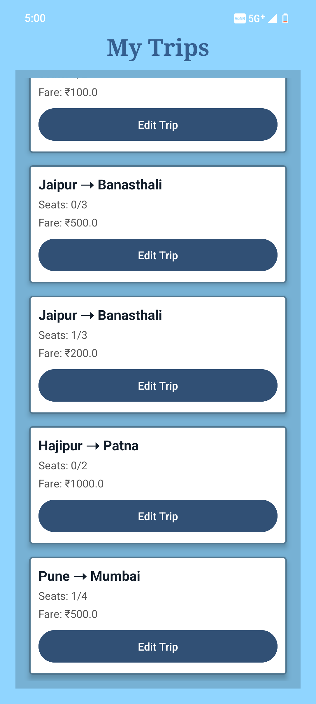


---

### Communication & Settings


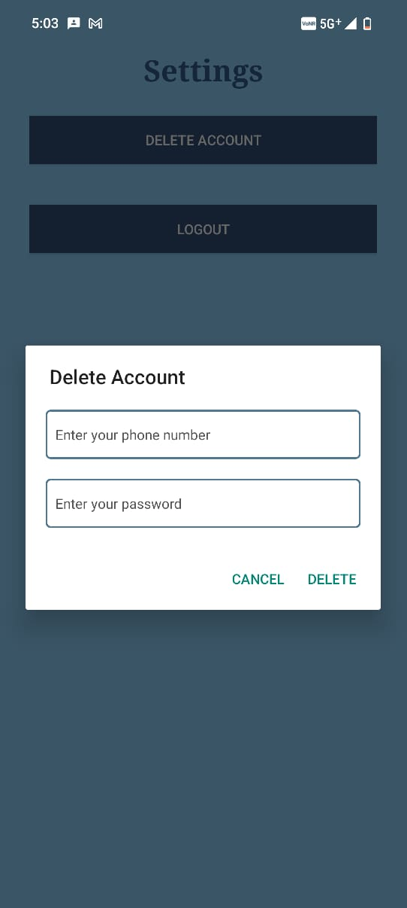

---

## 👩‍💻 Team Members

This project was developed as a collaborative team effort, where we worked together through all phases of design, development and testing.

- **Khushi Singh**
- **Khushi Shukla**
- **Vaishnavi Singh**

---
